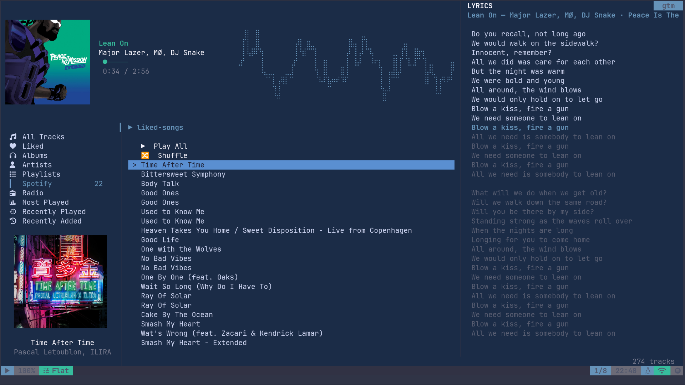

# gtm 📻


[](https://crates.io/crates/gtm)
[](https://crates.io/crates/gtm)
[](https://docs.rs/gtm)
[](https://github.com/prjctimg/gtm/actions/workflows/ci.yml)
[](https://github.com/prjctimg/gtm/blob/main/LICENSE)

A terminal music player (**gtm** — "goto music") with background playback and
YouTube/Spotify integration. It is a background daemon (`gtmd`) with a client
(`gtm`); you control it through the terminal.

## On this page

- [Features](#features)
- [Install](#install)
  - [Build from Source](#build-from-source)
  - [Termux](#termux-native-on-device)
- [Documentation](#documentation)
- [Contributing](#contributing)
- [Acknowledgements](#acknowledgements)
- [Contributors](#contributors)




## Features

- **Background playback**: reattach to the client from anywhere in the terminal
- **YouTube & Spotify**: search & download from YouTube and sync Spotify
  playlists; missing metadata/cover art is backfilled from Spotify, Deezer and
  MusicBrainz.
- **Internet radio**: browse the Radio Browser directory and stream any station
- **Podcasts**: subscribe to RSS/Atom feeds and play episodes in order
- **Top charts**: Spotify, Apple and community charts, browsable as a tree
- **Crossfade**: gapless-ish transitions with a configurable duration.
- **Lyrics**: automatic fetch from LRCLIB (default provider)
- **Metadata sync**: backfill missing tags, cover art, and lyrics for local files
- **Last.fm**: scrobbling, love and now-playing
- **Equalizer**: 16 presets
- **Visualizer**: 12 spectrum presets
- **Command palette**: fuzzy-finder over every TUI action
- **Extensions**: toggle optional surfaces per session
- **Playlist management**: Import/export `m3u8` playlists
- **Sleep timer**
- **Cover art support**: rendered inline via the kitty/terminal image protocol
- **Zero configuration**: sane defaults, fully customizable via TOML
- **Progress styles**: four indicators for the playback position
- **Theming**: accent colors extracted from the current track cover (reactive theming), transparent mode and 16 built-in themes
- **MPRIS**: media player controls via D-Bus

## Install

```bash
# stable (latest)
curl -fsSL https://gtmd.dev/install.sh | bash
```

For `nightly` builds (released on every push to `dev`):

```bash
# nightly
curl -fsSL https://gtmd.dev/install.sh | bash -s -- --nightly
```

Or grab an archive [releases page](https://github.com/prjctimg/gtm/releases/latest), extract it, and run the `./install.sh` in its directory

### Build from Source

Requires Rust 1.85+ (the workspace is edition 2024) and ALSA development headers (`libasound2-dev` on Debian/Ubuntu). `clang` is the default compiler (fallback to `gcc`) and uses `mold` when available instead of `ld`.

This produces a `nightly` build, for tagged versions, checkout first.

```bash

git clone https://github.com/prjctimg/gtm
cd gtm

cargo build --release

# Also installs completions,manpages etc
sudo make install
```

#### Termux (native, on-device)

```bash
pkg install rust clang pkg-config pulseaudio make

# build.rs auto-detects Termux and the Makefile enables the PulseAudio backend for you.
# (A manual equivalent is `cargo build --release --features pulseaudio`.)
make termux
```

`gtmd` auto-detects Termux at runtime, picks the PulseAudio
backend, and starts the PulseAudio server automatically — no manual
`pulseaudio --start` needed.

## Documentation

- [gtmd.dev](https://gtmd.dev) — guides, configuration reference and troubleshooting
- [gtm(1)](docs/man/gtm.1.md)
- [gtmd(1)](docs/man/gtmd.1.md)
- [gtmd-ipc(1)](docs/man/gtmd-ipc.1.md)


## Why another (terminal) audio player ?

You can read about it in [this post.](https://prjctimg.me/blg/feature-rich-terminal-audio-player)


## Contributing

This is a hobby project. It is feature complete and stable enough to use as a daily driver, though still largely a WIP.

See [CONTRIBUTING.md](CONTRIBUTING.md) for build instructions & the crate layout, and [CODE_OF_CONDUCT.md](CODE_OF_CONDUCT.md) for participation guidelines.

---

## Acknowledgements

- [color-thief](https://crates.io/crates/color-thief)
- [rustfft](https://crates.io/crates/rustfft)
- [ratatui](https://ratatui.rs),
  [ratatui-image](https://crates.io/crates/ratatui-image)
- [symphonia](https://crates.io/crates/symphonia),
  [fundsp](https://crates.io/crates/fundsp), and
  [rodio](https://crates.io/crates/rodio)
- [innertube-rs](https://crates.io/crates/innertube-rs)
- [LRCLIB](https://lrclib.net)
- [Myx](https://github.com/HaseebKhalid1507/Myx)
- [spotify-player](https://github.com/aome510/spotify-player)  

## Contributors

<!-- CONTRIBUTORS -->
<p align="left">
  <a href="https://github.com/iseeheaven"></a> <a href="https://github.com/prjctimg"></a> <a href="https://github.com/skchr"></a>
</p>
<!-- /CONTRIBUTORS -->

(c) 2026, [prjctimg](https://prjctimg.me)

Released under the GPL-3.0 license.
